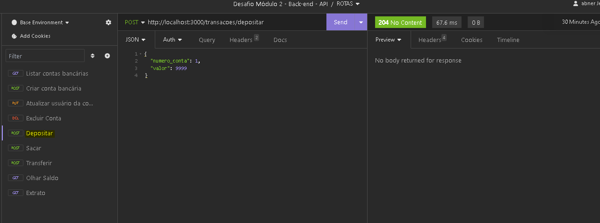
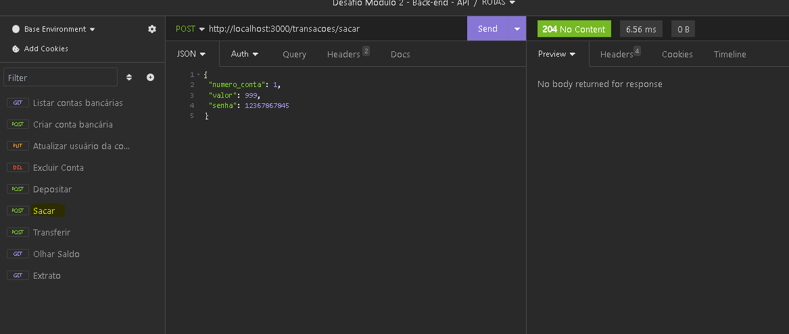
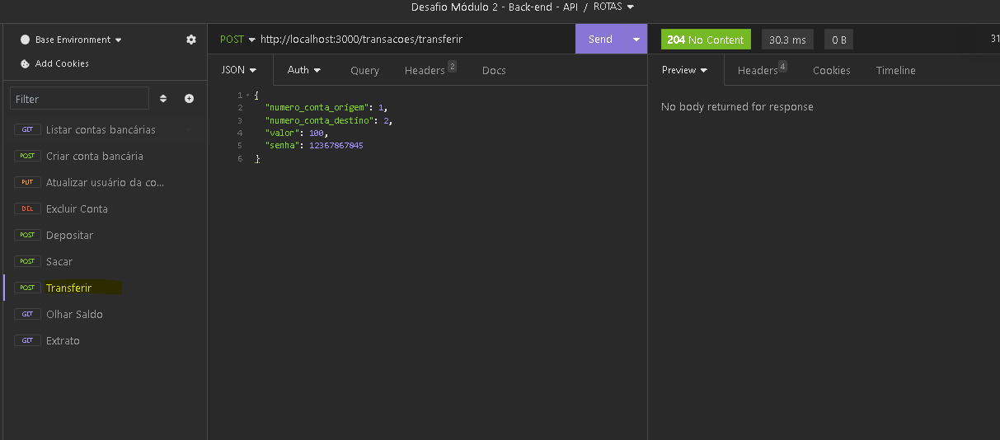
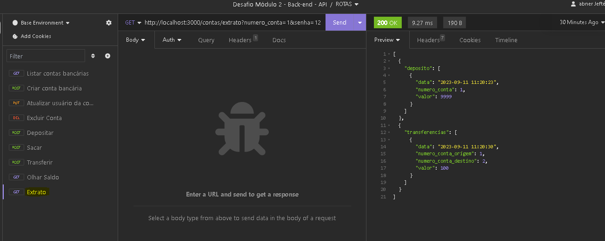

## Minha Api para Banco Digital

 Sejam bem-vindos a minha primeira Api Rest. Este é  um protótipo de Banco digital! Aprendi muito com este projeto, além de desafidador foi incrível! 

 ## O que é este projeto?

Esta  é uma aplicação simples de um banco digital. Como dono do banco, você pode:    

- Listar contas bancarias
- Criar conta bancaria
- Atualizar usuário
- Exluir conta
- Deposita
- Sacar
- Transeferir
- Olhar Saldo
- Fazer extrato

Cada função desta é um endepoint.

## Como Executar ?

Basta seguir estes passos:

#### Clone o repositório
- git clone git@github.com:Abnerdevv/Api-para-Banco-Digital.git
#### Instale as dependências
- npm install
#### Execute o projeto
- npm run dev

## Capturas de Tela do meu projeto

- Endpoint de Listas Contas

- Endpoint de Criar Conta

- Endpoint de Atualizar Conta

- Endpoint de  Exluir Conta

- Endpoint de Fazer Deposito 

- Endpoint de Sacar 

- Endpoint de Transferir Dinheiro

- Endpoint de Olhar Saldo

- Endpoint de Extrato

